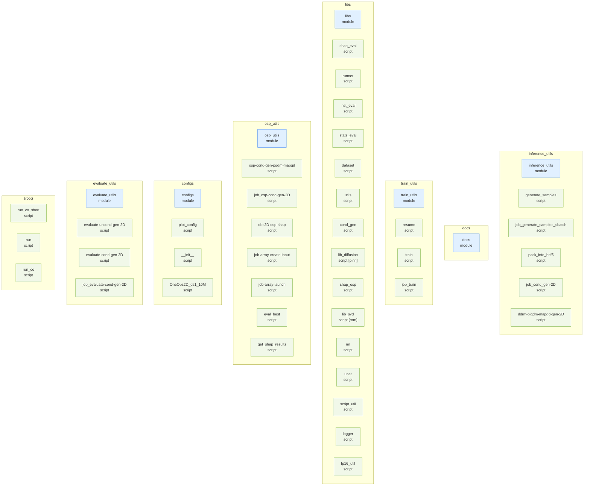
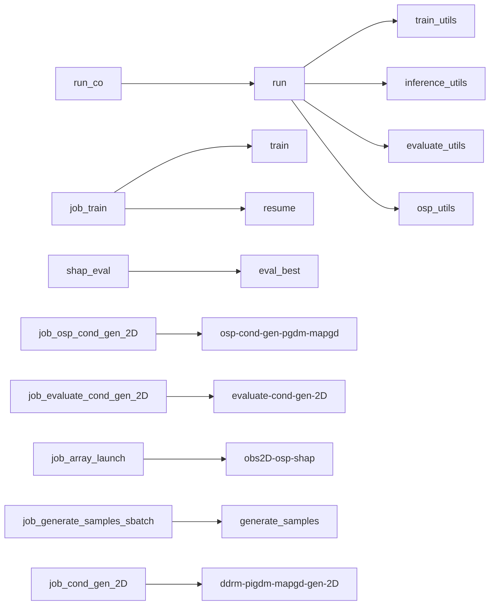

# diff-sport — Repository Topology Map

> Auto-generated by `repo-doc-miner/scripts/gen_topology.py` (v2, topology-first). This is the **first deliverable** of the mining process: a structural map of the repository. Refine the detected edges by reading the most important manifests, then deep-dive each module along these edges.

---

## 1. Structural Topology

## 2. Dependency Edges

Solid arrows = `uses`; dotted `... synced` arrows = `source → copy` (single source of truth synced into copies); dotted `"data: <prefix>"`-labeled arrows = `data-contract` (one entity writes a file another loads — no direct import/require between them).

## 3. Entity Inventory

| Kind | Count | Example locations |
| --- | --- | --- |
| script | 39 | `configs/OneObs2D_ds1_10M.py, configs/__init__.py, configs/plot_config.py` |
| module | 7 | `configs, docs, evaluate_utils` |

## 4. Excluded as Vendored

Dropped-in third-party library copies (matched by directory name or by an embedded package marker such as `setup.py`/`PKG-INFO` next to an `__init__.py`, or a sibling `*.dist-info`/`*.egg-info`) are excluded from every section above — they are not the repo's own code, and their generic `save()`/`load()` methods would otherwise flood the data-contract detector with false positives.

- `libs/shap/`

## 5. Module Deep-Dive Scaffold

> Walk these modules **along the dependency edges above**, highest complexity first. Replace each `> TODO(doc-miner)` with findings.

### inference_utils

- **inference_utils** (module) — `inference_utils`
  - > TODO(doc-miner): what does inference_utils do and which entities does it reference?
- **generate_samples** (script) — `inference_utils/unconditional_generation/generate_samples.py` (~1 KB)
  - CLI (`seed`, `config_name`, optional `savedir`) that builds the DDPM via `libs.runner.create_model_and_initialize_ddpm`/`load_model`, calls `runner.generate_samples` for unconditional rollouts, and saves `generated_samples_<config>_seed<seed>_ep500.npy`.
- **job_generate_samples_sbatch** (script) — `inference_utils/unconditional_generation/job_generate_samples_sbatch.sh` (~0 KB)
  - SLURM sbatch wrapper (scheduler header stripped for release) that forwards `seed`/`configname` to `generate_samples.py`.
- **pack_into_hdf5** (script) — `inference_utils/unconditional_generation/pack_into_hdf5.py` (~1 KB)
  - CLI (`config_name`, one or more `.npy` files) that packs multiple `generate_samples.py` outputs into one HDF5 (`generated_samples-25k-<config>_ep1000.h5`, one `seed_N` dataset per input file) — the file `evaluate-uncond-gen-2D.py` reads back via `config.dataset.pred_data_file`.
- **job_cond_gen-2D** (script) — `inference_utils/conditional_generation/job_cond_gen-2D.sh` (~0 KB)
  - SLURM sbatch wrapper forwarding `mask`/`gen_seed`/`mask_seed`/`select_random_sensors` to `ddrm-pigdm-mapgd-gen-2D.py`.
- **ddrm-pigdm-mapgd-gen-2D** (script) — `inference_utils/conditional_generation/ddrm-pigdm-mapgd-gen-2D.py` (~6 KB)
  - CLI for conditional generation: builds a sensor mask via `libs.cond_gen.create_mask`/`Inpainting_custom` (`libs/lib_svd.py`), then runs all three posterior samplers on the trained DDPM — `reverse_diffusion_ddrm`, `reverse_diffusion_pgdm`, `reverse_diffusion_gd` (MAP-GD) from `libs/lib_diffusion.py::DDPM_R` — and writes one HDF5 with `data`/`ddrm`/`pgdm`/`mapgd` datasets.

### docs

- **docs** (module) — `docs`
  - > TODO(doc-miner): what does docs do and which entities does it reference?

### train_utils

- **train_utils** (module) — `train_utils`
  - > TODO(doc-miner): what does train_utils do and which entities does it reference?
- **resume** (script) — `train_utils/resume.py` (~0 KB)
  - CLI (`modelname`) that rebuilds the DDPM via `libs.runner.create_model_and_initialize_ddpm`, loads the dataset via `runner.load_dataset`, and continues training via `runner.resume` (loads the last checkpoint, unlike `train.py`).
- **train** (script) — `train_utils/train.py` (~0 KB)
  - CLI (`modelname`) that builds the DDPM + dataset the same way as `resume.py` and calls `runner.train` for a fresh training run, timestamping start/end.
- **job_train** (script) — `train_utils/job_train.sh` (~0 KB)
  - SLURM sbatch wrapper forwarding `configname` to `train.py` (with a commented-out `resume.py` alternative).

### libs

- **libs** (module) — `libs`
  - > TODO(doc-miner): what does libs do and which entities does it reference?
- **shap_eval** (script) — `libs/shap_eval.py` (~47 KB)
  - SHAP-based optimal-sensor-placement evaluation/plotting library: loads `.h5` result files (`load_file_data`), computes/normalizes SHAP-value statistics (`compute_mean_shap_values`, `normalize_shap_values`), builds sensor masks from thresholds (`create_shap_masks`), and aggregates reconstruction error vs. sensor count across seeds (`calculate_error_metrics_with_seeds[_without_best_selection]`, `plot_mixed_binned_and_direct`) — used by `osp_utils/evaluate_best/eval_best.py` and `osp_utils/osp-cond-gen-pgdm-mapgd.py`.
- **runner** (script) — `libs/runner.py` (~11 KB)
  - Core training/inference orchestration: `create_model_and_initialize_ddpm`/`load_model` build the `DDPM_R` model and diffusion schedule from a config dict, `load_dataset` wraps `libs.dataset`, and `train`/`resume`/`generate_samples[_legacy]` implement the training loop and unconditional sampling — imported by every entry-point script in `train_utils/`, `inference_utils/`, and `osp_utils/`.
- **inst_eval** (script) — `libs/inst_eval.py` (~11 KB)
  - `InstantaneousEvaluation` class: given ground-truth + up to two prediction fields, plots per-snapshot comparisons and error evolution (`plot_inst_comp_and_error`, `error_evolution` from `libs/utils.py`) and PDF-of-error comparisons (`plot_pdf_comparison[_to_pdf]`) — used by `evaluate_utils/evaluate-cond-gen-2D.py`.
- **stats_eval** (script) — `libs/stats_eval.py` (~38 KB)
  - `StatisticalEvaluation` class: given ground-truth + one prediction field, produces a PDF of mean-profile, Reynolds-stress (line/plane), velocity-PDF, and power-spectral-density comparisons (`.main()`) — used by `evaluate_utils/evaluate-uncond-gen-2D.py`.
- **dataset** (script) — `libs/dataset.py` (~8 KB)
  - `OneObs2D` (`torch.utils.data.Dataset`) plus `get_2Dtest_data`/`read_hdf5` helpers: loads `u_fluc`/`v_fluc` fields from an HDF5 file, downsamples by `config.dataset.ds_ratio`, and stacks the two channels into the `(N, 2, H, W)` tensor shape the DDPM consumes.
- **utils** (script) — `libs/utils.py` (~26 KB)
  - Grab-bag of shared helpers: model-precision checks (`check_conv_layers_precision`/`check_model_precision` — near-duplicates of the same-named functions in `runner.py`), plotting primitives (`plot_subplot`, `plot_inst_comp_and_error`, `add_obstacle_patch`, coordinate conversion `convert_unit2pixel`), timing (`get_current_time`/`get_time_difference`), and `combine_fields`/`select_random`/`get_velocity_magnitude`.
- **cond_gen** (script) — `libs/cond_gen.py` (~21 KB)
  - Conditional-generation support: `get_data` loads train/test HDF5 fields, `normalize`/`renormalize` map to/from `[-1, 1]`, `create_mask`/`create_random_mask_within_ground_and_wall` build sensor masks (optionally segmented), and `plot_mask`/`plot_sensor_importance` visualize them — used by every `*cond-gen*`/`osp*` script.
- **lib_diffusion** (script) — `libs/lib_diffusion.py` (~43 KB) — detected loss: MSELoss
  - `DDPM`/`DDPM_R` classes: forward/reverse diffusion (`forward_diffusion`, `reverse_diffusion`), a cosine/linear `make_schedule`, and training loss `torch.nn.MSELoss(reduction='none')` (`DDPM` ctor, confirmed at line 221). `DDPM_R` adds the three posterior samplers used for conditional generation: `reverse_diffusion_ddrm`, `reverse_diffusion_pgdm` (Π-GDM), `reverse_diffusion_gd` (MAP-GD, plus a `_mask_batches` variant).
- **shap_osp** (script) — `libs/shap_osp.py` (~21 KB)
  - `shap_osp` class wrapping a trained DDPM as a SHAP-explainable function of a sensor mask (`model_function_mask_batches`), for `obs2D-osp-shap.py`'s `shap.KernelExplainer` call; `get_shap_features` extracts per-segment features from a segmentation tensor.
- **lib_svd** (script) — `libs/lib_svd.py` (~11 KB)
  - Adapted from the DDRM repo's `svd_replacement.py`: `H_functions` base class plus `Inpainting_custom`/`Inpainting_custom_mask_batches` — the sensor-mask forward operator `H` used by every DDRM/Π-GDM/MAP-GD reverse-diffusion call (`H.H(data)` produces the masked observation).
- **nn** (script) — `libs/guided_diffusion/nn.py` (~4 KB)
  - Vendored-style (from OpenAI's guided-diffusion) low-level NN helpers: `SiLU`/`GroupNorm32`, `conv_nd`/`linear`/`avg_pool_nd` dimension-agnostic layer factories, `timestep_embedding`, `checkpoint`/`CheckpointFunction` for gradient checkpointing — imported by `unet.py`.
- **unet** (script) — `libs/guided_diffusion/unet.py` (~30 KB)
  - OpenAI guided-diffusion U-Net: `ResBlock`, `AttentionBlock`/`QKVAttention[Legacy]`, `Upsample`/`Downsample`, and the top-level `UNetModel` (plus `SuperResModel`/`EncoderUNetModel` variants) — built via `script_util.create_model` and used as the DDPM's denoising network in `runner.create_model_and_initialize_ddpm`.
- **script_util** (script) — `libs/guided_diffusion/script_util.py` (~12 KB)
  - Config/factory glue for `unet.py`: `model_and_diffusion_defaults`/`classifier_defaults` supply default kwargs, `create_model`/`create_classifier`/`create_gaussian_diffusion` construct the model+diffusion objects, and `add_dict_to_argparser`/`args_to_dict` wire them to argparse. No docstring/leading comment, hence the bare placeholder before this pass.
- **logger** (script) — `libs/guided_diffusion/logger.py` (~13 KB)
  - Copied from OpenAI's `baselines` logger (per its own header) to avoid an RL-framework dependency: `KVWriter`/`SeqWriter` output-format classes (human/JSON/CSV/TensorBoard) and module-level `logkv`/`log`/`dumpkvs` convenience functions. Not observed to be imported by any other file in this list.
- **fp16_util** (script) — `libs/guided_diffusion/fp16_util.py` (~7 KB)
  - Mixed-precision training helpers for the U-Net: `convert_module_to_f16/f32`, master-parameter flatten/unflatten (`make_master_params`, `master_params_to_model_params`), and the `MixedPrecisionTrainer` class; imported by `unet.py` for `use_fp16` support.

### osp_utils

- **osp_utils** (module) — `osp_utils`
  - > TODO(doc-miner): what does osp_utils do and which entities does it reference?
- **osp-cond-gen-pgdm-mapgd** (script) — `osp_utils/osp-cond-gen-pgdm-mapgd.py` (~8 KB)
  - CLI for optimal-sensor-placement conditional generation: loads a precomputed sensor mask (`shap`/`shap-reduced-mask`/`qr` — each with its own mask-file path convention under `config.eval.osp_dir`), then runs `reverse_diffusion_ddrm`/`_pgdm`/`_gd` the same way as `ddrm-pigdm-mapgd-gen-2D.py`, writing an `osp-threshold-...` HDF5.
- **job_osp-cond-gen-2D** (script) — `osp_utils/job_osp-cond-gen-2D.sh` (~0 KB)
  - SLURM sbatch wrapper forwarding `osp_method`/`threshold`/`start`/`stop`/`step`/`datatype`/`strategy`/`seed` to `osp-cond-gen-pgdm-mapgd.py`.
- **obs2D-osp-shap** (script) — `osp_utils/shap/obs2D-osp-shap.py` (~4 KB)
  - CLI that runs `shap.KernelExplainer` (vendored `libs/shap/`) over `libs.shap_osp.shap_osp.model_function_mask_batches` to attribute per-segment sensor importance, saving `.npz` results under `results/shaply-values/` — the results `osp_utils/evaluate_best/get_shap_results.py`/`eval_best.py` later thresholds into masks.
- **job-array-create-input** (script) — `osp_utils/shap/job-array-create-input.sh` (~0 KB)
  - Not an sbatch job itself — a param-sweep generator: writes one `start stop step coalition` line per array task to `input_params.txt`, consumed by `job-array-launch.sh`.
- **job-array-launch** (script) — `osp_utils/shap/job-array-launch.sh` (~0 KB)
  - SLURM array-job wrapper: reads its `$SLURM_ARRAY_TASK_ID`-th line from `input_params.txt` (produced by `job-array-create-input.sh`) and forwards the parsed params to `obs2D-osp-shap.py`.
- **eval_best** (script) — `osp_utils/evaluate_best/eval_best.py` (~6 KB)
  - Aggregates SHAP-mask and QR-pivoting reconstruction-error results across thresholds/seeds via `libs.shap_eval.calculate_error_metrics_with_seeds[_without_best_selection]`, compares against a saved random-sensor baseline (`random_baseline_results_v2*.npz`), plots error-vs-sensor-count curves and sensor-importance maps, and pickles the aggregated `datasets_with[out]_best_selection` dicts (consumed by `get_shap_results.py`).
- **get_shap_results** (script) — `osp_utils/evaluate_best/get_shap_results.py` (~3 KB)
  - Despite the entity name, its actual docstring header is `plot_saved_dicts.py`: reloads the pickles written by `eval_best.py` and re-plots them via `libs.shap_eval.plot_mixed_binned_and_direct` plus sensor-importance maps, without recomputing the underlying error metrics.

### configs

- **configs** (module) — `configs`
  - > TODO(doc-miner): what does configs do and which entities does it reference?
- **plot_config** (script) — `configs/plot_config.py` (~3 KB)
  - No docstring/leading comment (hence the bare placeholder). Defines `plot_dict` (figure size/dpi, the shared color palette, LaTeX axis/label strings) and `basic_plt_setup()`, imported by nearly every plotting module in `libs/`.
- **__init__** (script) — `configs/__init__.py` (~0 KB)
  - No docstring (hence the bare placeholder) — just `__all__ = ['OneObs2D_ds1_10M']`, making `from configs import *` resolve to that one config module across all the entry-point scripts.
- **OneObs2D_ds1_10M** (script) — `configs/OneObs2D_ds1_10M.py` (~4 KB)
  - Builds `config_dict` (the sole registered config, `config_name="OneObs2D_ds1_10M"`): dataset paths (train/test/pred HDF5, `ds_ratio=1`), model image size `(288, 96)`, and checkpoint/eval directory paths — this is the dict every `CONFIG_DICT[...]` lookup in the other scripts resolves to.

### evaluate_utils

- **evaluate_utils** (module) — `evaluate_utils`
  - > TODO(doc-miner): what does evaluate_utils do and which entities does it reference?
- **evaluate-uncond-gen-2D** (script) — `evaluate_utils/evaluate-uncond-gen-2D.py` (~2 KB)
  - CLI (`configname`, `num` snapshots, `result_dir`) that loads the packed unconditional-generation HDF5 (`config.dataset.pred_data_file`, written by `pack_into_hdf5.py`), renormalizes it, and runs `libs.stats_eval.StatisticalEvaluation.main()` to produce a `stats_eval-*.pdf`.
- **evaluate-cond-gen-2D** (script) — `evaluate_utils/evaluate-cond-gen-2D.py` (~2 KB)
  - CLI (`configname`, `mask_type`, `mask`, `snaps`, `num`, `results_dir`) that loads a conditional-generation HDF5 (written by `ddrm-pigdm-mapgd-gen-2D.py`) and runs `libs.inst_eval.InstantaneousEvaluation.main()` comparing MAP-GD vs. Π-GDM predictions, producing a `cond_eval-*.pdf`.
- **job_evaluate-cond-gen-2D** (script) — `evaluate_utils/job_evaluate-cond-gen-2D.sh` (~0 KB)
  - SLURM sbatch wrapper (defaults `mask=30`, `snaps=100`, `num=3`) forwarding to `evaluate-cond-gen-2D.py`.

### (root)

- **run_co_short** (script) — `run_co_short.sh` (~0 KB)
  - One-line wrapper: `bash run.sh shap-summary "$@"` — re-plots cached SHAP/QR comparison results without recomputing anything.
- **run** (script) — `run.sh` (~8 KB)
  - The single CLI entry point for the whole repo: dispatches 10 subcommands (`train`, `gen-uncond`, `pack-uncond`, `gen-cond`, `eval-uncond`, `eval-cond`, `shap-values`, `gen-osp`, `eval-best`, `shap-summary`) to the corresponding Python script under `train_utils/`, `inference_utils/`, `evaluate_utils/`, or `osp_utils/`, each invoked as `python <script> <config> ...`. `ensure_data` pre-checks that `configs/<config>.py`'s `data_file`/`test_data_file` exist before running.
- **run_co** (script) — `run_co.sh` (~2 KB)
  - Orchestrates the full Code Ocean reproduction pipeline by calling `run.sh` for steps 1-7 (train → gen/pack/eval unconditional → gen/eval conditional baseline → SHAP values), then prints two manual-step reminders (QR-pivoting and SHAP-aggregation notebooks under `osp_utils/`) before listing the remaining steps 10-11 to run by hand.

---

> Refine this map, then use it as the backbone for `developer_guide.md`, `user_guide.md`, and `tutorial.md`.